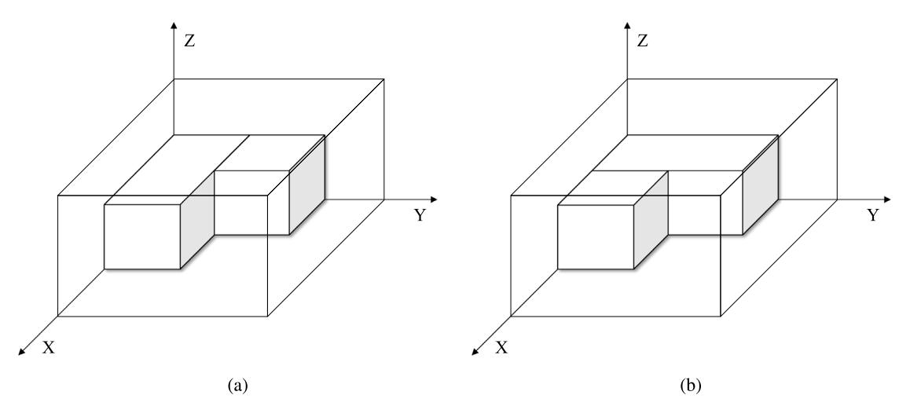
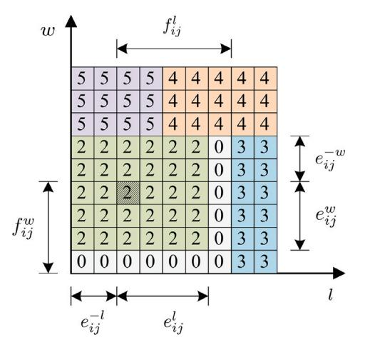
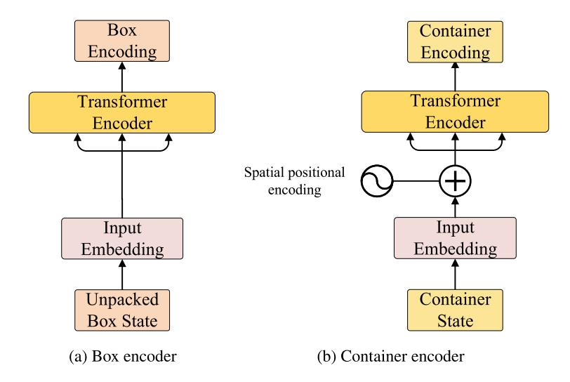
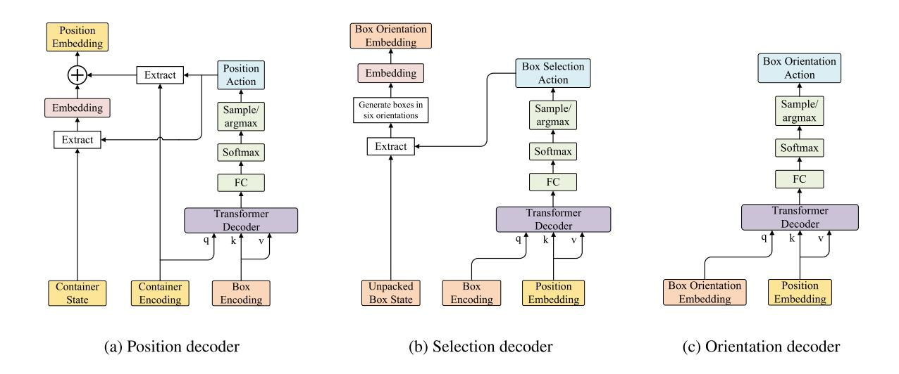
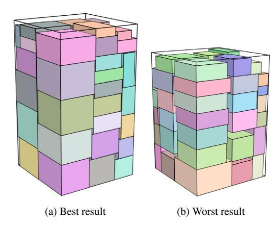
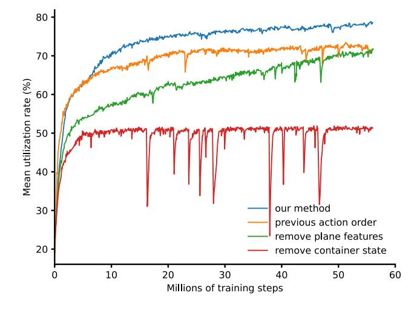

# Solving 3D packing problem using Transformer network and reinforcement learning

Quanqing Que [a](#page-0-0) , Fang Yang [b](#page-0-1) , Defu Zhang [a](#page-0-0),[∗](#page-0-2)

- a *Department of Computer Science and Technology, Xiamen University, Xiamen 361000, China*
- b *Coding (Xiamen) Big Data Technology Co., Ltd., Xiamen 361000, China*

## A R T I C L E I N F O

*Keywords:* 3D packing problem Deep reinforcement learning Transformer

## A B S T R A C T

The three-dimensional packing problem (3D-PP) is a classic NP-hard problem in operations research and computer science. One of the most popular ways to solve the problem is heuristic methods with a search strategy. However, approaches based on machine learning have recently received widespread attention because of their efficiency. In this work, we propose a deep reinforcement learning (DRL) model to solve 3D-PP. Our method employs Transformer architecture as the policy network and uses Proximal Policy Optimization (PPO) to train the network. Compared with previous approaches using DRL, our method presents a novel state representation of packing environment, and introduces plane features for representing the length and width information of container. Our method achieves the new state-of-the-art results for using DRL to solve 3D-PP. The code of our method will be released to facilitate future research.

### **1. Introduction**

In this paper, we focus on solving the 3D-PP using deep reinforcement learning (DRL), which has received widespread attention due to its efficiency to solve advanced real-world challenges. 3D-PP is a classical and important combinatorial optimization problem, which has a wide range of applications in the cutting and packing industry, e.g., when cutting wood or foam rubber into smaller pieces, loading pallets with items, or packing goods into containers ([Pisinger](#page-8-0), [2002\)](#page-8-0). The most common application scenario of 3D-PP is the transportation and logistics industry. The COVID-19 pandemic has led to considerable growth in online shopping, which has inevitably brought new challenges to the transportation industry. However, loading in logistics transportation is still mainly done based on human experience, which makes it difficult to ensure the utilization of container space, thus increasing the logistics costs of enterprises. The goal of 3D-PP is to maximize the space utilization of containers, which can help logistics companies maximize the use of transportation tools to reduce transportation costs. 3D-PP needs to pack some small boxes into some large containers with several constraints. All these boxes are assumed to be rectangular-shaped and are packed orthogonally into the container. Besides, the problem considered in this paper allows the boxes to be rotated in any orthogonal direction. The objective of 3D-PP is to maximize the total volume of boxes packed into a container. This paper studies a variant of 3D-PP, where the container height can be adjusted according to the loaded boxes but container width and height are fixed [\(Wu, Li, Goh, & De Souza](#page-9-0), [2010\)](#page-9-0). The objective of the problem is to minimize the variable container height.

3D-PP is strongly NP-hard ([Bischoff & Marriott](#page-8-1), [1990\)](#page-8-1). Therefore it is difficult to exactly solve the problem with large box numbers [\(Silva,](#page-9-1) [Toffolo, & Wauters](#page-9-1), [2019\)](#page-9-1). Many heuristic methods and search algorithms have been presented to solve it approximately [\(Ali, Ramos,](#page-8-2) [Carravilla, & Oliveira,](#page-8-2) [2022\)](#page-8-2). Meta-heuristic algorithms and search algorithms (e.g., genetic algorithms, simulated annealing and tree search) can obtain effective solutions but may require massive computation, which is time-consuming, while heuristic algorithms are more efficient but they may produce a worse solution than the meta-heuristic algorithms and rely heavily on handcrafted rules designed by human experts. Besides, the performance of the meta-heuristic is heavily dependent on the artificially and empirically designed search rules, resulting in its inability to stably receive high-quality solutions. In recent years, therefore, researchers have started to apply deep reinforcement learning (DRL) to solve 3D-PP [\(Duan et al.,](#page-8-3) [2018](#page-8-3); [Jiang, Cao, & Zhang](#page-8-4), [2021;](#page-8-4) [Li, Ren, Gu, Wang, & Lau](#page-8-5), [2020](#page-8-5)). Compared with the traditional methods for the 3D-PP, DRL needs to train deep neural networks on a huge number of problem instances, but it can more stably obtain solutions of reasonably good quality in a short time. This paper focuses on applying DRL to solve 3D-PP with variable container height. The contributions of this article can be summarized as follows:

• We implement a DRL model that adopts Transformer as the policy network, which is trained using Proximal Policy Optimization(PPO). Our model can achieve new state-of-the-art results for using DRL to solve the 3D-PP.

- Compared with the previous works using DRL, we propose a novel state representation method, which separately represents the state of the container and boxes, thus improving the training efficiency. We also design the network architecture to output sub-actions in a different order from previous works.
- We introduce plane features to represent the information of the container in the length and width direction. The method is shown to produce superior results than the model without plane features.

#### **2. Related work**

In this section, we review existing works on 3D-PP, including conventional algorithms and DRL methods.

#### *2.1. Conventional methods*

Conventional methods can be divided into exact algorithms, heuristics methods, meta-heuristics and tree-search methods. Some researchers ([Chen, Lee, & Shen,](#page-8-6) [1995;](#page-8-6) [Junqueira, Morabito, & Yamashita](#page-8-7), [2012;](#page-8-7) [Ocloo, Fügenschuh, & Pamen](#page-8-8), [2020](#page-8-8); [Paquay, Schyns, & Lim](#page-8-9)[bourg](#page-8-9), [2016\)](#page-8-9) formulated the 3D-PP as a mixed integer programming model (MILP) and used a commercial solver to solve it exactly. [Martello,](#page-8-10) [Pisinger, and Vigo](#page-8-10) ([2000\)](#page-8-10) presented an exact branch-and-bound method to find optimal solutions for the problem with small-size instances (with up to 20 boxes). Exact algorithms can receive an optimal solution, but these algorithms cannot address the problems of large box numbers.

The existing methods for the 3D-PP are mainly based on heuristic methods. Compared with exact algorithms, heuristic methods may only find an approximate solution in most cases but they can be used for real-world-sized problems and take a reasonable amount of time. [Ngoi and Whybrew](#page-8-11) [\(1993](#page-8-11)) proposed a fast spatial representation method that treats the container as a three-dimensional matrix. This three-dimensional matrix is divided into multiple two-dimensional matrices, each of which represents the change in the cross-section of the container. [Bischoff](#page-8-12) ([2006\)](#page-8-12) proposed a spatial representation method based on [Ngoi and Whybrew](#page-8-11) ([1993\)](#page-8-11), which uses a two-dimensional matrix to represent the spatial information of the container. This twodimensional matrix is the stacked height of boxes at each position of the top view of the current container. [Crainic, Perboli, and Tadei](#page-8-13) ([2008\)](#page-8-13) defined the extreme point concept and proposed an extreme pointbased rule for packing boxes inside a three-dimensional container. [Gürbüz, Akyokuş, Emiroğlu, and Güran](#page-8-14) ([2009\)](#page-8-14) presented an algorithm called Largest Area First-Fit (LAFF). In the algorithm, the box with the largest surface area will be packed first. [Toffolo, Esprit, Wauters, and](#page-9-2) [Berghe](#page-9-2) [\(2017](#page-9-2)) proposed a two-dimensional heuristic decomposition approach for 3D-MBPP. Their approach first pack boxes into stacks and then pack these stacks into containers. Since these stacks are treated as 2D items in their approach, the second step is converted to a 2D bin packing problem. [George and Robinson](#page-8-15) [\(1980](#page-8-15)) first proposed a concept of residual space to represent the spatial information of containers. They defined the initial container as an initial residual space. Whenever a box is loaded into a residual space, three separate new residual spaces are generated. The complete spatial information of a container is represented by a list of residual spaces. They also presented a wall-building approach to loading a box. [Moura and Oliveira](#page-8-16) ([2005\)](#page-8-16) presented an adaptation of the wall-building approach proposed by [George and](#page-8-15) [Robinson](#page-8-15) [\(1980](#page-8-15)). In contrast to the original version, their method limits the width of the new height space to the area above the packed boxes to improve cargo stability. [Parreño, Alvarez-Valdés, Tamarit, and Oliveira](#page-8-17) ([2008\)](#page-8-17) proposed a maximal-space algorithm based on [George and](#page-8-15) [Robinson](#page-8-15) [\(1980\)](#page-8-15). The algorithm cut up to six residual spaces in different directions at the same time after loading a box. Compared with the cutting method in [George and Robinson](#page-8-15) [\(1980](#page-8-15)), the different residual space generated by maximal space may have overlapping areas. The maximal-space method does not need to merge the residual spaces during the packing process and can maximize the space available for loading the container, so it has been used by many subsequent heuristic methods proposed by other researchers. [Saraiva, Nepomuceno, and](#page-8-18) [Pinheiro](#page-8-18) ([2015\)](#page-8-18) proposed a layer-building algorithm for the threedimensional multiple bin packing problem (3D-MBPP) with several box constraints that arises in an automotive company. Their algorithm first builds horizontal layers of identical items and then chooses a free space according to two fixed heuristic rules. [Hasan, Kaabi, and](#page-8-19) [Harrath](#page-8-19) ([2019\)](#page-8-19) developed a layer-building method consisting of two main phases to deal with a multiobjective 3D bin packing problem. The first stage constructs all the possible combinations of horizontal layers using identical boxes that can fit in a bin volume-wise. The second phase explores these combinations to decide the minimum number of containers needed to pack the boxes. [Elhedhli, Gzara, and](#page-8-20) [Yildiz](#page-8-20) ([2019\)](#page-8-20) proposed three enhancement strategies to construct dense and stable layers for the 3D bin packing problem (3D-BPP). The first strategy is based on the formation of superitems. The second is an itemreplacement strategy. The third is a layer-spacing strategy. [Araújo and](#page-8-21) [Armentano](#page-8-21) ([2007\)](#page-8-21) proposed a block building approach to solve a 3D-BPP with a set of weakly heterogeneous boxes as well as orientation and stability constraints. The algorithm first generates maximal cuboids that fit in given empty spaces using each type of unpacked box. Then at each step of the packing process, one maximal cuboid is selected by a set of criteria to load into the container. To extend the block building method to the problem with strongly heterogeneous boxes, [Fanslau and](#page-8-22) [Bortfeldt](#page-8-22) ([2010](#page-8-22)) presented a method that can generate blocks consisting of different boxes with small inner gaps.

Heuristic algorithms are usually able to obtain a solution in a shorter time, but by combining some meta-heuristics or search algorithms, the quality of the solution can be further improved at the cost of some time spent searching. [Bortfeldt and Gehring](#page-8-23) [\(1998\)](#page-8-23) developed a block building approach combining a tabu search algorithm to solve a container loading problem (CLP) with different constraints. [Nepomuceno,](#page-8-24) [Pinheiro, and Coelho](#page-8-24) [\(2007](#page-8-24)) proposed a hybrid method combining integer linear (ILP) programming and genetic algorithms (GAs) for solving the CLP. The authors used GAs to generate reduced problem instances of the original CLP, which are formulated as ILP models and solved by an exact optimization technique (solver). [Wu et al.](#page-9-0) ([2010\)](#page-9-0) proposed a method combining the genetic algorithm and the deepest bottom left heuristic to solve the 3D-PP with variable container height. [Kang,](#page-8-25) [Moon, and Wang](#page-8-25) ([2012\)](#page-8-25) proposed a hybrid genetic algorithm with a packing strategy, which seeks to minimize the cuboid spaces, to solve the three-dimensional bin packing problem. [Ceschia and Schaerf](#page-8-26) ([2013\)](#page-8-26) designed two meta-heuristic strategies based on simulated annealing and tuba search as well as used a block building approach to solve a complex variant of the CLP which considers multiple containers and several constraints. [Xiang, Yu, Xu, and Zhu](#page-9-3) ([2018\)](#page-9-3) proposed a placement heuristic method based on the wall-building approach proposed by [George and Robinson](#page-8-15) ([1980\)](#page-8-15) with an adaptive genetic algorithm to address an optimized container loading problem. The method can improve space utilization by 4.42% in comparison with George and Robinson's algorithm. [Olsson, Larsson, and Quttineh](#page-8-27) ([2020\)](#page-8-27) presented a two-level metaheuristic approach for the CLP. The method applies a genetic algorithm at the upper level to tune the objective function for a lower-level greedy-type constructive placement heuristic, to iteratively update the quality of the solution. [Mostaghimi Ghomi, St Amour, and](#page-8-28) [Abdul-Kader](#page-8-28) ([2017\)](#page-8-28) formulated a mixed-integer programming model of the 3D-knapsack problems. They also developed a simulated annealing heuristic approach to improve the quality of solutions. [Sheng et al.](#page-8-29) ([2017\)](#page-8-29) proposed a heuristic algorithm for the CLP with expiring orders which must be packed before the non-expiring ones. The algorithm first applies a simulated annealing strategy to choose a collection of orders and then packs all items of the selected orders into the container using a tree-graph search procedure. [Pisinger](#page-8-0) ([2002](#page-8-0)) proposed a heuristic

**Table 1** Comparison of the three types of methods.

| Methods    | Advantages                 | Disadvantages          |
|------------|----------------------------|------------------------|
| Exact      | Can obtain an optimal      | Cannot address large   |
| algorithms | solution                   | box numbers            |
| Heuristic  | Can obtain a solution in a | Unable to obtain       |
| algorithms | shorter time               | high-quality solutions |
| Meta       | Can obtain high-quality    | The search process is  |
| heuristics | approximate solutions      | time-consuming         |

algorithm based on the wall building approach that combines a treesearch algorithm. The tree-search algorithm in their method is used to find the optimal layer depths and strip widths of the wall building algorithm. [Ren, Tian, and Sawaragi](#page-8-30) ([2011\)](#page-8-30) and [Zhu and Lim](#page-9-4) ([2012\)](#page-9-4) combined the block building heuristics and tree search algorithm to tackle the CLP with multiple practical constraints. The authors developed different block building approaches to pack boxes and used tree search algorithms to choose the residual spaces and the blocks. [Araya,](#page-8-31) [Guerrero, and Nuñez](#page-8-31) ([2017\)](#page-8-31), [Araya, Moyano, and Sanchez](#page-8-32) ([2020\)](#page-8-32) and [Araya and Riff](#page-8-33) [\(2014](#page-8-33)) used beam search combined with block building method to solve the container loading problem (CLP). Their proposed method reports some of the best results for the CLP to date. In [Table](#page-2-0) [1](#page-2-0) we summarize the advantages and disadvantages of the three types of methods mentioned above.

#### *2.2. DRL methods*

Due to the rapid development of deep learning, researchers have started to solve combinatorial optimization using the DRL technique. Deepmind achieved considerable success in adopting the DRL to solve Go ([Schrittwieser et al.,](#page-8-34) [2020](#page-8-34)), which shows the great potential of DRL in combinatorial optimization problems. [Vinyals, Fortunato, and Jaitly](#page-9-5) ([2015\)](#page-9-5) first proposed a Pointer Net (Ptr-Net) architecture, inspired by sequence-to-sequence models, to learn approximate solutions to the planar traveling salesman problem (TSP) in a supervised way. Since supervised learning acquires optimal solutions as ground truth, which is time-consuming, [Bello, Pham, Le, Norouzi, and Bengio](#page-8-35) ([2016\)](#page-8-35) later used a reinforcement learning (RL) method to train the Ptr-Net. [Nazari,](#page-8-36) [Oroojlooy, Snyder, and Takác](#page-8-36) [\(2018](#page-8-36)) designed a new model based on the Ptr-Net, which makes the model invariant with respect to the input sequence, to solve the TSP and vehicle routing problems. [Kool, Van Hoof, and Welling](#page-8-37) ([2018\)](#page-8-37) presented an encoder–decoder model based on attention layers and used the REINFORCE to train the neural network. [Lu, Zhang, and Yang](#page-8-38) ([2020\)](#page-8-38) presented a learningbased method for solving capacitated vehicle routing problem (CVRP). Their model learns to iteratively improve the solution with an operator selected by a reinforcement learning-based controller. Inspired by the successful adoption of DRL in routing problems, several researchers have tried to use DRL to solve the 3D-PP. [Hu, Zhang, Yan, Wang, and Xu](#page-8-39) ([2017\)](#page-8-39) applied a DRL-based method to optimize the sequence of boxes to be packed into the container. But in their model, the orientation and position of the selected box are still decided by the conventional heuristic methods. [Duan et al.](#page-8-3) [\(2018](#page-8-3)) proposed a multitask selected learning framework based on the method in [Hu et al.](#page-8-39) [\(2017](#page-8-39)) to solve the 3D flexible bin packing problem. The multi-task networks are trained by both reinforcement and supervised learning to output the orientation and sequence of boxes, while the position of boxes is decided by a greedy heuristic. [Li et al.](#page-8-5) [\(2020](#page-8-5)) first proposed a fully end-to-end policy network that is trained by actor–critic methods for the packing problem to sequentially decide the index, rotation and position of boxes. [Jiang](#page-8-4) [et al.](#page-8-4) ([2021\)](#page-8-4) improved the model in [Li et al.](#page-8-5) ([2020\)](#page-8-5) by introducing the sparse transformer and action representation. The improvement of the method enables the agent to solve large-scale instances with up to 120 boxes. Their method outperforms all other DRL methods for 3D-PP.

Overall, previous DRL methods for 3D-PP mainly used a multimodule network structure for processing sub-actions and trained the network using an actor–critic reinforcement learning algorithm. However, the previous approaches have several disadvantages as follows: (1) The action order of these DRL methods is not reasonable. (2) These DRL methods use the packing history of the boxes as the input to the network. This state representation way makes multiple different states repeatedly express the same container information, which increases the complexity of reinforcement learning training. (3) Although the DRL method in [Jiang et al.](#page-8-4) ([2021\)](#page-8-4) inputs the top view of the container as additional information to the network, this top view only includes information about the container in the vertical direction, but not in the horizontal direction. (4) The top view of the container of the method in [Jiang et al.](#page-8-4) ([2021\)](#page-8-4) has a large size, resulting in an excessive action space for the position action.

To address these disadvantages, we propose the following measures in our method: (1) We adjust the order of the different sub-actions. (2) Instead of using the packing history of the box, we use the container state and the unpacked box state to jointly represent the current state of the problem. (3) We propose a new representation of the container state so that the information of all three directions of the container can be represented. (4) We design a novel downsampling method for the 3D-PP to reduce the action space of the position action.

#### **3. Method**

In the section we introduce our method in two aspects: the network architecture and the training process. We design an encoder–decoder architecture employing the Transformer ([Vaswani et al.,](#page-9-6) [2017](#page-9-6)) for both the policy network and the value network. We also propose a different state representation from prior works according to the characteristic of 3D-PP. We use the PPO [\(Schulman, Wolski, Dhariwal, Radford, &](#page-8-40) [Klimov,](#page-8-40) [2017\)](#page-8-40), a classic actor–critic DRL method, to train the networks. We illustrate the details of the training process in this section, including the design of reward and loss functions.

### *3.1. Network architecture*

The network of an actor–critic method includes two parts: the value network and the policy network. To stabilize the training, we use a separate structure for the value network and the policy network. The two networks use the same *packing state* as input, but the outputs of the two networks are different. The value network outputs a numerical value that represents the state value $v_\pi(s_t)$. The policy network outputs a probability distribution $\pi(a_t|s_t)$ over actions $a_t$ that guide the agent to solve a 3D-PP.

#### *3.1.1. State representation*

In the DRL, states are observations of the environment by the agent. In the 3D-PP, intuitively the observations of the environment consist of two parts: the observation of the container and the observation of the box unpacked. However, most previous works ([Jiang et al.,](#page-8-4) [2021](#page-8-4); [Li](#page-8-5) [et al.](#page-8-5), [2020\)](#page-8-5) define states to represent both the observation of the container and the boxes as $s_t = \{s_i\}_{i \in 1...n}$, where $s_i = (p_i,l_i, w_i, h_i, x_i, y_i, z_i)$; $p_i$ indicates whether box is packed; $(l_i, w_i, h_i)$ represents the dimensions of box $i$; $(x_i, y_i, z_i)$ refers to the coordinate of box $i$ packed. It should be noted that the state $s_t$ describes both the condition of the boxes and the container. The representation of the box observation by $s_t$ is obvious. And the loading condition of the container can be uniquely determined while the position and dimensions of packed boxes are given; therefore the container observation is implicitly represented by $s_t$. The advantage of this representation method is that it describes both container and box situations using a single state. However, it may lead to multiple different states describing the same container situation, thereby increasing the difficulty of the model to learn the policy. 

Fig. 1. The two containers have the same status but previous works use different states to represent them.

Fig. 2. An example marking the value of plane features for a  $9 \times 9$  container.

We can take a simple example to explain this point clearly. Consider two specific states:

$$s_t^1 = \{(1, 5, 10, 5, 0, 0, 0), (1, 5, 5, 5, 5, 0, 0)\}$$

$$s_t^{2} = \{(1, 10, 5, 5, 0, 0, 0), (1, 5, 5, 5, 0, 5, 0)\}$$

Now assume that we have a policy  $\pi(a_t|s_t)$  and for the two states we have  $\pi(a_t|s_t^1)$  and  $\pi(a_t|s_t^2)$ . Obviously, the two states  $s_t^1$  and  $s_t^2$  are different; therefore  $\pi(a_t|s_t^1)$  is not necessarily equal to  $\pi(a_t|s_t^2)$ . However, it can be observed that the two states  $s_t^1$  and  $s_t^2$  describe the same container status in fact (To more intuitively illustrate this point, we visualize these two containers in Fig. 1.). Therefore, we expect the same value of  $\pi(a_t|s_t)$  for the two states certainly but the representation method of state the past works used cannot ensure this. Although they could train the model using a huge number of instances to make  $\pi(a_t|s_t^1)$  close to  $\pi(a_t|s_t^2)$ , it would waste a lot of training time.

Considering the defect mentioned above we propose a novel representation method of packing state  $s_i$ . We describe the state of 3D-PP at each step by two different channels: the box state  $s^b$  and the container state  $s^c$ . We define the box state  $s^b$  as  $s^b = \{b_1, b_2, \dots, b_n\}$ , where  $b_i = (l_i, w_i, h_i)$  refers to the dimensions of box i;  $l_i$ ,  $w_i$  and  $h_i$  are the length, width and height of box i respectively; n is the number of unpacked boxes. It should be noted that the box state  $s^b$  does not contain the boxes that have been packed. Because when the container

status is additionally defined, the information about the dimensions of these boxes is unnecessary for the agent to decide the action.

The container state  $s^c$  is defined as

$$s^{c} = \begin{bmatrix} c_{11} & c_{12} & \cdots & c_{1W} \\ c_{21} & c_{22} & \cdots & c_{2W} \\ \vdots & \vdots & \ddots & \vdots \\ c_{L1} & c_{L2} & \cdots & c_{LW} \end{bmatrix}$$

where L and W refer to the length and width of the container respectively;  $c_{ij} = \{h_{ij}, e_{ij}^l, e_{ij}^w, e_{ij}^{-l}, e_{ij}^{-w}, f_{ij}^l, f_{ij}^w\}$  indicates the information at the position  $p_{ij}$  ( $p_{ij}$  is the position of row i and column j of the top view of the container.). The  $h_{ij}$  indicates the current height of stacked boxes at the position  $p_{ij}$ . The remaining six values  $\{e_{ij}^l, e_{ij}^w, e_{ij}^{-l}, e_{ij}^{-w}, f_{ij}^l, f_{ij}^w\}$ , which we call plane features, provide the network with information in the length and the width direction of the container.$\{e_{ij}^l, e_{ij}^w, e_{ij}^{-l}, e_{ij}^{-w}\}$  refer to the distance between the position $p_{ij}$ and the edge of the plane.
$\{f_{ij}^l, f_{ij}^w\}$ indicate the distance between the position $p_{ij}$ and the nearest plane which is higher than $p_{ij}$ . Fig. 2 takes an example for a 9 × 9
container. In Fig. 2, the number at each position indicates the stacked height $h_{ij}$ . The values of plane features $\{e_{ij}^l, e_{ij}^w, e_{ij}^{-l}, e_{ij}^{-w}, f_{ij}^l, f_{ij}^w\}$ for the shaded position $p_{ij}$ are marked in Fig. 2. The plane features can be produced easily by the stacked height $h_ij$.

Actually, compared with the existing methods using DRL, the state representation of our method is more similar to the thinking process of human beings. When packing a box, human workers cannot imagine the container situation by the history of loading. They need to observe the status of the container and unpacked boxes separately to decide how to pack the next box.

#### 3.1.2. Actions

Classic container packing problem has a combinatorial action space. For the 3D-PP, each action  $a_t$  consists of three distinct types of subactions: the box selection action  $a_t^s$  decides which box to be packed at the current step; the box orientation action  $a_t^o$  decides the orientation of the selected box; the position action  $a_t^p$  decides where the selected box will be packed. In our model, all the actions are discrete. At each step, there are more than  $10^6$  possible action choices, which is difficult for the DRL method to handle. Therefore it is necessary to take measures to reduce the number of action choices. The policy of our method is a function  $\pi(a_t|s_t)$  that maps the packing state  $s_t$  to a probability distribution over actions  $a_t$  for the current step. Since  $a_t = (a_t^s, a_t^o, a_t^p)$ , using the chain rule, the function can be decomposed into the product of three probability distributions as

$$\pi(a_t|s_t) = \pi(a_t^s, a_t^o, a_t^p|s_t) = \pi(a_t^p|s_t)\pi(a_t^s|a_t^p, s_t)\pi(a_t^o|a_t^p, a_t^s, s_t)$$
(1)

According to Eq. (1), we implement three sub-modules in our policy network to output three probability distributions separately thereby decomposing the combinatorial action space to reduce the number of action choices.

#### 3.1.3. Networks

All of our network backbones uniformly use the Transformer structure and employ some linear units to handle the input and output of the Transformer structure. The reasons for using the Transformer structure are as follows: (1) The input of the Transformer is flexible. The Transformer can take either a one-dimensional sequence as input or a two-dimensional plane as input, which allows us to use the Transformer structure to handle our container state and box state uniformly. (2) A network for the box sequence should satisfy two requirements. First, it should be able to handle variable-length sequences. Second, it should be permutation invariant — the output of the network should not change under any permutation of the elements in the input sequence (Lee et al., 2019). The Transformer structure without positional encodings satisfies both of these requirements very well. (3) The Transformer structure can be used to effectively establish a relationship between the box state and the container state.

The policy of our method  $\pi_{\theta_a}(a_t|s_t)$  is represented by a neural network with parameters  $\theta_a$ . The policy network receives both the container state  $s^c$  and the box state  $s^b$  as inputs and outputs a probability distribution over actions. We use an encoder–decoder architecture adopting the Transformer to represent the policy and value network. For the policy neural network, the encoder–decoder architecture comprises two encoders and three decoders. The two encoders, which we call container encoder and box encoder, generate the encodings of the container state and box state. The three decoders, which we call position decoder, selection decoder and orientation decoder, respectively generate three probability distributions over three sub-actions. The following introduces these five modules in the policy network separately.

Box encoder The architecture of box encoder is shown in Fig. 3(a). The input of box encoder is unpacked box state. The unpacked box state is defined as  $s^b = \{b_1, b_2, \dots, b_n\}$ , where  $b_i = \{l_i, w_i, h_i\}$ . Firstly, the length, width and height of each box are converted to a vector of dimension  $d_{\text{model}}$  thereby generating a  $N \times 3 \times d_{\text{model}}$  box feature sequence. Since in our problem each box can be rotated, we expect that the boxes with the same dimension but different orientation will provide the same information to the network. Therefore, we perform the average operation on the second dimension of the sequence, resulting in a new  $N \times d_{\text{model}}$  sequence. We feed the sequence into the Transformer encoder to get the box encoding. The architecture of Transformer Encoder is similar to the original Transformer (Vaswani et al., 2017) but without positional encoding.

Container encoder Fig. 3(b) summarizes the architecture the of container encoder. A container with a large size results in a large action space for the position action. Therefore, we should downsample the container state to reduce the action space before feeding it into the container encoder. There are many developed methods for downsampling a spatial feature map but these methods are almost proposed for pictures. In our model, we present an easy but effective method to downsample the container state of the 3D-PP. It first splits the container state into non-overlapping patches. In our implementation, a  $100 \times 100 \times 7$ container state is partitioned using a patch size of  $10 \times 10$  and thus the shape of each patch is  $10 \times 10 \times 7$ . For each patch, we only retain the feature vector with a maximal value of  $e^l \times e^w$ , where  $e^l$  is the plane feature in the length direction and  $e^{w}$  is in the width direction, and discard the rest. Finally, we receive a downsampled container state with the size of  $10 \times 10 \times 7$ . In other words, for a  $100 \times 100$  container state  $s^c$ , we split it as

$$s^c = \begin{bmatrix} p^{1,1} & p^{1,2} & \cdots & p^{1,10} \\ p^{2,1} & p^{2,2} & \cdots & p^{2,10} \\ \vdots & \vdots & \ddots & \vdots \\ p^{10,1} & p^{10,2} & \cdots & p^{10,10} \end{bmatrix}$$

where

$$p^{ij} = \begin{bmatrix} c_{i,j} & c_{i,j+1} & \cdots & c_{i,j+9} \\ c_{i+1,j} & c_{i+1,j+1} & \cdots & c_{i+1,j+9} \\ \vdots & \vdots & \ddots & \vdots \\ c_{i+9,j} & c_{i+9,j+1} & \cdots & c_{i+9,j+9} \end{bmatrix}$$

For each patch  $p^{ij}$ , we define the downsampled patch  $p_{ds}^{ij}$  as

$$m, n = \underset{ij}{\operatorname{arg\,max}}(e_{ij}^{l} \times e_{ij}^{w})$$

$$p_{ds}^{ij} = c_{mn}$$

Finally, the downsampled container state  $s_{ds}^c$  is defined as

$$s_{ds}^{c} = \begin{bmatrix} p_{ds}^{1,1} & p_{ds}^{1,2} & \cdots & p_{ds}^{1,10} \\ p_{ds}^{2,1} & p_{ds}^{2,2} & \cdots & p_{ds}^{2,10} \\ \vdots & \vdots & \ddots & \vdots \\ p_{ds}^{10,1} & p_{ds}^{10,2} & \cdots & p_{ds}^{10,10} \end{bmatrix}$$

Similar to the box encoder, we use a learned embedding to convert the dimension of downsampled container state. Since the Transformer network expects a sequence as input, we collapse the spacial dimensions of the downsampled container state into one dimension before feeding it into the encoder. We also add fixed positional encodings (Parmar et al., 2018) to the input to retain positional information of the container state. The architecture of the Transformer encoder in the container encoder is the same as that in the box encoder. Finally, we receive the container encoding through the container encoder.

Position decoder In the position decoder, the container encoding from the container encoder is input into an Transformer decoder as *query* and the box encoding is input as key–value. And then we use a fully connected feed-forward network and softmax function to receive the probability distribution  $\pi(a_t^p|s_t)$  over the position action  $a_t^p$ . We sample a position action  $a_t^p$  from  $\pi(a_t^p|s_t)$ . The position action  $a_t^p$  indicates a coordinate (x, y) where the next box will be packed. We extract the feature vector at the point (x, y) of container encoding and add it to the feature vector at the point (x, y) of original container state  $s^c$ . Through feeding the result into a full connected network we can get the position embedding.

Selection decoder In the selection decoder, we feed the box encoding into the Transformer decoder as query and feed the position embedding as key-value. Notice that in the position decoder the box encoding is key-value, while in selection decoder it is query. The reason for the different design of the two modules is that for the Transformer decoder the dimension of output sequence is equal to that of query. In the selection decoder, we expect the length of the output sequence to be equal to the number of boxes. Therefore we input the box encoding as query instead of key-value. Similar to the position decoder, we can obtain the probability distribution  $\pi(a_t^s|s_t)$  over the box selection action a, through a full-connected network and a softmax function. We sample an action  $a_t^s$  from  $\pi(a_t^s|a_t^p,s_t)$  as the box selection action. According to the  $a_t^s$ , we can receive a box from the unpacked box sequence. Then we generate a box orientation sequence  $s_o = \{b_s^i\}_{i=0,1,\dots,5}$ , where  $b_s^i$  is the dimensions of the *i*th orientation of the selected box. We use a learned embedding to convert the box orientation sequence, resulting in the box orientation embedding.

*Orientation decoder* In the orientation decoder, we feed the box orientation embedding into the Transformer decoder as *query* and feed the position embedding as *key-value*. Through a full-connected network and softmax function, the orientation decoder outputs the probability distribution  $\pi(a_t^o|a_t^s, a_t^p, s_t)$  over the *box orientation action*  $a_t^o$ . We sample an box orientation action  $a_t^o$  from  $\pi(a_t^o|a_t^s, a_t^p, s_t)$ . Fig. 4 summarizes the architecture of the three decoders mentioned above.

Fig. 3. The architecture of two encoders in the policy network.

Fig. 4. The architecture of three decoders in the policy network. Notice that the position embedding in the position decoder is one of the inputs of the selection decoder. The position embedding in the position decoder and the box orientation embedding in the selection decoder are the inputs of the orientation decoder.

Action order The order deciding the three types of actions in our model is different from previous works. We first decide the *position action* and finally decide the *box orientation action*. But previous works using DRL select a box before deciding the position where the box will be packed.

*Value network* The value network uses Transformer encoder–decoder architecture like the policy network to output a numerical value  $V(s_t)$ . The inputs of the value network are the same as the policy network, that is, container state  $s_t^c$  and box state  $s_t^b$ .

#### 3.2 Training process

#### 3.2.1 Rewards

The objective of 3D-PP is to maximize the utilization rate of a container. An intuitive design of reward in 3D-PP is that the reward in terminal time is set to the utilization rate and in other time is set to 0 (Zhao, She, Zhu, Yang, & Xu, 2020). Obviously, the reward signal in the design is very sparse for a 3D-PP, which has some unfavorable effects on the performance of the algorithm. Therefore, we define the

reward signal referring to the paper (Li et al., 2020).

$$reward = g_{i-1} - g_i$$

$$g_i = WL\widetilde{H}_i - \sum_{i=1}^{i} (w_i l_j h_j)$$

where  $\widetilde{H}_i$  refers to the stacked height of packed boxes at step i;  $\sum_{j=1}^i (w_j l_j h_j)$  refers to the total volume of boxes packed into the container;  $g_i$  indicates the gap between box total volume and stacked total volume. In the initial step, the gap is obviously equal to 0. In the terminal step, the gap is equal to the wasted space of the packing problem.

#### 3.2.2 Training

The network is trained using PPO with Generalized Advantage Estimation (GAE) (Schulman, Moritz, Levine, Jordan, & Abbeel, 2015). The main objective of PPO is as follows (Schulman et al., 2017):

$$r_t(\theta) = \frac{\pi_{\theta} \left( a_t | s_t \right)}{\pi_{\theta_{\text{old}}} \left( a_t | s_t \right)}$$

$$L^{CLIP}(\theta) = \hat{\mathbb{E}}_t \left[ \min \left( r_t(\theta) \hat{A}_t, \operatorname{clip} \left( r_t(\theta), 1 - \epsilon, 1 + \epsilon \right) \hat{A}_t \right) \right]$$

where  $\epsilon$  is a hyperparameter, and  $\hat{A}_t$  refers to the advantage function calculated by GAE. The action  $a_t$  is the combination of three sub-actions, that is,  $a_t = (a_t^s, a_t^o, a_t^b)$ . Therefore,

$$\begin{split} 
r_{t}(\theta) &= \frac{\pi_{\theta} \left( a_{t} | s_{t} \right)}{\pi_{\theta_{\text{old}}} \left( a_{t} | s_{t} \right)} \\ &= \frac{\pi_{\theta} \left( a_{t}^{p}, a_{t}^{s}, a_{t}^{o} | s_{t} \right)}{\pi_{\theta_{\text{old}}} \left( a_{t}^{p}, a_{t}^{s}, a_{t}^{o} | s_{t} \right)} \\ &= \frac{\pi_{\theta p} \left( a_{t}^{p}, a_{t}^{s}, a_{t}^{o} | s_{t} \right) \pi_{\theta s} \left( a_{t}^{s} | a_{t}^{p}, s_{t} \right) \pi_{\theta o} \left( a_{t}^{o} | a_{t}^{p}, a_{t}^{s}, s_{t} \right)}{\pi_{\theta_{\text{old}}^p} \left( a_{t}^{o} | s_{t} \right) \pi_{\theta_{\text{old}}^s} \left( a_{t}^{s} | a_{t}^{p}, s_{t} \right) \pi_{\theta_{\text{old}}^o} \left( a_{t}^{o} | a_{t}^{p}, a_{t}^{s}, s_{t} \right)} 
\end{split}$$

$$(2)$$

As mentioned in 3.1.3, the policy network outputs three probability distributions  $\pi_{\theta^p}\left(a_t^p|s_t\right)$ ,  $\pi_{\theta^s}\left(a_t^s|a_t^p,s_t\right)$  and  $\pi_{\theta^o}\left(a_t^o|a_t^p,a_t^s,s_t\right)$  respectively. We substitute them into Eq. (2) to get  $r_t(\theta)$ . The loss function for our DRL method is defined as follows:

$$\begin{split} \mathcal{L}_{\text{actor}} &= -\min \left( r_t(\theta) \hat{A}_t, \text{clip} \left( r_t(\theta), 1 - \epsilon, 1 + \epsilon \right) \hat{A}_t \right) \\ \mathcal{L}_{critic} &= \text{MSE} \left( V_{\theta_c} \left( s_t \right), \hat{A}_t + V_{\theta_c} \left( s_t \right) \right). \\ \mathcal{L}_{\text{entropy}} &= -\sum \left( \pi_{\theta^s} \log \pi_{\theta^s} + \pi_{\theta^o} \log \pi_{\theta^o} + \pi_{\theta^p} \log \pi_{\theta^p} \right) \\ \mathcal{L} &= \mathcal{L}_{\text{actor}} + \mathcal{L}_{critic} + \beta \mathcal{L}_{\text{entropy}} \end{split}$$

where  $\beta$  is a hyperparameter that used to balance exploration and exploitation.

#### 4 Experiments and analyses

#### 4.1 Setup and hyper-parameters

We follow the same settings as previous works to randomly generate the problem instances for training and . Specifically, the length L and width W of the container are both set to 100. Notice that the problem we study is 3D-PP with available height; therefore the height of the container does not need to be set. The dimensions  $(l_i, w_i, h_i)$  of each box are sampled from the intervals [L/10, L/2], [W/10, W/2] and  $[\min(L, W)/10, \max(L, W)/2]$ , respectively. Regarding the Transformer architecture, we use two layers for both encoders and decoders. We set the dimension of attention embedding  $d_h = 128$ . The number of attention heads of encoders and decoders are set to 4 and 8, respectively. We use Adam as the optimizer. The learning rate for the policy network is set to 1e-5 and for the value network is set to 1e-4. In the PPO learning process, the discount factor  $\gamma$  is set to 0.99 and the decay factor  $\lambda = 0.96$  for GAE. The clip rate  $\epsilon$  for PPO is set to 0.12. All experiments run on an AMD Ryzen 5 CPU 2600 with an Nvidia 3090 GPU and the DRL models are implemented in PyTorch. Training those DRL models until convergence takes about four days to a week.

#### 4.2 Performance comparison

In Table 2 we compare the performance of our methods with prior algorithms including heuristic and DRL methods. The results of prior algorithms are obtained from Jiang et al. (2021). The utilization rate (UR) and computation time are considered to measure the packing performance. In specific, the UR is defined as follows:

$$UR = \frac{\sum_{i} l_{i} w_{i} h_{i}}{LW \widetilde{H}_{n}}$$

We consider three sub-problems with the number of boxes N=20,30,50, respectively. We record the average UR on 1024 randomly generated testing instances as Jiang et al. (2021). For each instance, we sample 16 solutions using the DRL agent and output the best one as the final result. As shown in Table 2, our method achieves the new state-of-the-art result compared with previous DRL methods. For the cases of 20 and 30 boxes, it can be seen that our method improves

Fig. 5. The best result (UR: 87.51%) and the worst result (UR: 75.54%) of the 1024 testing instances for 50 boxes.

the utilization rate significantly, and for the case of 50 boxes the result also has a slight improvement. The sample number of solutions has some effects on the quality of the final solution. To reduce the computation time, we only sample 16 solutions but other DRL methods in Table 2 sample 128 solutions (Jiang et al., 2021). In Table 3 we compare the average UR and computation time of our method for different sample numbers of solutions. It can be observed that when the sample number of solutions is greater than 16, the computation time increases substantially while the improvement of the computation results is relatively small. Therefore, we use 16 as the sample number of solutions instead of 128. Fig. 5 visualizes the best and worst results of the 1024 testing instances generated by our method for 50 boxes. We also compare our method with other approaches on two larger containers of  $200 \times 200$  and  $400 \times 200$  with 50 boxes, respectively. The results in Table 4 show that our method can receive better results even on problems with larger containers.

#### 4.3 Ablation study

Compared with the previous work using DRL, our model takes a different approach to represent state and adjust the order of subactions. In this section we verify the effectiveness of these new designs. We conduct ablation studies on the  $100 \times 100$  container by removing the corresponding design separately. Table 5 shows the influence of action order (AO), container state(CS) and plane features (PF) for the utilization rate. The absence of a check mark in the AO column indicates that the model adopts the action order previous papers used. The absence of a check mark in the CS column indicates that the model uses packing history of boxes as input of network. As shown in the Table 5, all three of these new designs can improve the utilization rate. Besides, we can find that the improvement is greater for instance with a higher number of boxes. Fig. 6 shows the mean utilization rate during the training process for ablation study with 50 box number. From Fig. 6 we can find that although the method without plane features eventually converges to a result close to that of the method using previous action order, the absence of plane features will result in a slower convergence rate.

#### 5 Discussion

As shown in Table 2, our method improves recent DRL methods with an optimal gap of 6.5% for 20 boxes, 5.0% for 30 boxes and 1.3% for 50 boxes. It can be noted that our methods can obtain a larger improvement for problems with fewer boxes. This is because the results of the problem with fewer boxes obtained by the previous method are lower and there is more potential for improvement. For the different

**Table 2** Comparison results for the problems of different numbers of boxes.

|           | Method                      | N = 20 | N = 30 |       |      | N = 50 |      |
|-----------|-----------------------------|--------|--------|-------|------|--------|------|
|           |                             | UR     | Time   | UR    | Time | UR     | Time |
|           | GA+DBLF (Wu et al., 2010)   | 70.2%  | 17.5   | 69.4% | 36.3 | 66.3%  | 71.9 |
| Heuristic | EP (Crainic et al., 2008)   | 62.7%  | <1     | 63.8% | <1   | 66.3%  | <1   |
|           | LAFF (Gürbüz et al., 2009)  | 58.6%  | <1     | 59.1% | <1   | 61.9%  | <1   |
|           | EBAFIT (Jiang et al., 2021) | 65.4%  | <1     | 65.9% | <1   | 66.1%  | 1.5  |
|           | MTSL (Duan et al., 2018)    | 62.4%  | 4.8    | 60.1% | 10.2 | 55.3%  | 23   |
| DRL       | CQL (Li et al., 2020)       | 67.0%  | 1      | 69.3% | 1.2  | 73.6%  | 3.3  |
|           | JIANG (Jiang et al., 2021)  | 71.8%  | 1.2    | 75.5% | 1.5  | 81.3%  | 3.8  |
|           | OUR                         | 76.5%  | 1.4    | 79.3% | 2.1  | 82.4%  | 3.5  |

**Table 3** Comparison results for different sample numbers of solutions.

| Sample number of solutions | N = 20 |      | N = 30 |      | N = 50 |      |
|----------------------------|--------|------|--------|------|--------|------|
|                            | UR     | Time | UR     | Time | UR     | Time |
| 1                          | 73.4%  | 0.7  | 76.0%  | 1.1  | 80.3%  | 2.0  |
| 2                          | 74.6%  | 0.8  | 76.7%  | 1.3  | 81.2%  | 2.1  |
| 4                          | 75.5%  | 0.9  | 77.5%  | 1.4  | 81.9%  | 2.3  |
| 8                          | 75.8%  | 1.0  | 78.3%  | 1.5  | 82.2%  | 2.5  |
| 16                         | 76.5%  | 1.4  | 79.3%  | 2.1  | 82.4%  | 3.5  |
| 32                         | 76.8%  | 2.3  | 79.6%  | 3.4  | 82.9%  | 6.1  |
| 64                         | 77.0%  | 3.7  | 79.9%  | 5.8  | 83.1%  | 10.2 |
| 128                        | 77.5%  | 6.2  | 80.4%  | 9.7  | 83.4%  | 15.1 |

**Table 4** Comparison results for the problems of different container size.

| Bin Size  | GA+DBLF | EP    | LAFF  | EBAFIT | MTSL  | CQL   | JIANG | OUR   |
|-----------|---------|-------|-------|--------|-------|-------|-------|-------|
| 100 × 100 | 66.3%   | 66.3% | 61.9% | 66.1%  | 55.3% | 73.6% | 81.3% | 82.4% |
| 200 × 200 | 61.4%   | 63.3% | 58.0% | 62.8%  | 50.8% | 58.7% | 75.2% | 80.5% |
| 400 × 200 | 58.7%   | 60.1% | 55.4% | 60.5%  | 46.9% | 47.5% | 70.5% | 76.7% |

**Table 5** Ablation study.

| AO | PF | CS | N = 20 | N = 30 | N = 50 |
|----|----|----|--------|--------|--------|
| ✓  |    |    | 52.1%  | 58.6%  | 55.2%  |
|    |    | ✓  | 74.5%  | 76.5%  | 77.5%  |
| ✓  |    | ✓  | 76.0%  | 77.9%  | 77.4%  |
|    | ✓  | ✓  | 75.1%  | 76.4%  | 77.1%  |
| ✓  | ✓  | ✓  | 76.5%  | 79.3%  | 82.4%  |

container sizes, our method improves recent DRL methods with an optimal gap of 1.3% for 100 × 100 container, 7.0% for 200 × 200 container and 8.8% for 400 × 200 container as shown in [Table](#page-7-2) [4](#page-7-2). On larger container sizes, our method obtains a greater improvement. Compared to the previous DRL method, we use a novel approach to downsample the container state that allows our algorithm to achieve a bigger increase on the larger container problem.

As can be seen by the curves plotted in [Fig.](#page-7-4) [6,](#page-7-4) the rate of increase of the average utilization drops substantially when we remove the plane features from the states. This is because when we remove the plane features from the container state, the model cannot directly obtain the state of the container in the horizontal direction. To obtain the information about the container in the horizontal direction, the model needs more training to get this information indirectly, which leads to a substantial decrease in the speed of training. In the early stages of training, the rate of increase in utilization for the two different action order is close, but after further training, our method is able to obtain a further increase in utilization. This indicates that the action order in our method is more reasonable than the previous one. Comparing the utilization rates of the two methods using different action order for the different numbers of boxes in [Table](#page-7-3) [5,](#page-7-3) it can be found that when the number of boxes is higher, the action order in our method can receive a larger increase. This point is actually close to the thinking process of human beings. In the practical packing process, if there is

**Fig. 6.** Mean utilization rate of different methods with different training steps in 3D-PP with 50 box number.

only a small amount of boxes available, human workers may choose the next box from these boxes before deciding where the box will be packed. But if there are a large number of boxes human workers will tend to first think about what position in the container is suitable for the next loading, and then select a box that is suitable for loading in that position. This is the reason why we design a different order of subactions from previous DRL methods. As can be seen from [Fig.](#page-7-4) [6](#page-7-4) and [Table](#page-7-3) [5,](#page-7-3) when the container state is removed, the average utilization decreases significantly during the training process, and the final results decrease by 31.8%, 26.1% and 33.0% for 20, 30 and 50 boxes, respectively, compared to our method. Removing the container state has a more dramatic impact on the results than removing the plane features. This is because when the container state is completely removed, all information about the container is indirectly obtained by relying on the packing history, which greatly increases the training burden and thus leads to a significant decrease in utilization.

#### **6 Conclusions**

In this paper we propose a DRL approach for solving 3D-PP with variable height. We propose a novel container state representation method and plane features to improve the results for solving 3D-PP using DRL methods. The results obtained by our model outperform that of all the DRL models for solving the 3D-PP in cases up to 50 boxes. Our work provides a new thought and architecture for solving 3D-PP. For future work, we would like to apply the solution framework to solve other combinatorial optimization problems (e.g., knapsack problems, routing problems and job-shop scheduling problems). Besides, it is interesting to improve the generalization of our method thereby adopting it to real-world instances and the packing problem with large boxes.

#### **CRediT authorship contribution statement**

**Quanqing Que:** Conceptualization, Methodology, Software, Investigation, Data curation, Writing – original draft. **Fang Yang:** Writing – review & editing. **Defu Zhang:** Supervision, Writing – review & editing.

#### **Declaration of competing interest**

The authors declare that they have no known competing financial interests or personal relationships that could have appeared to influence the work reported in this paper.

#### **Data availability**

The code of our method will be released upon publication.

## **References**

- [Ali, S., Ramos, A. G., Carravilla, M. A., & Oliveira, J. F. \(2022\). On-line three](http://refhub.elsevier.com/S0957-4174(22)02171-6/sb1)[dimensional packing problems: a review of off-line and on-line solution approaches.](http://refhub.elsevier.com/S0957-4174(22)02171-6/sb1) *[Computers & Industrial Engineering](http://refhub.elsevier.com/S0957-4174(22)02171-6/sb1)*, Article 108122.
- [Araújo, O. C. B. d., & Armentano, V. A. \(2007\). A multi-start random constructive](http://refhub.elsevier.com/S0957-4174(22)02171-6/sb2) [heuristic for the container loading problem.](http://refhub.elsevier.com/S0957-4174(22)02171-6/sb2) *Pesquisa Operacional*, *27*, 311–331.
- [Araya, I., Guerrero, K., & Nuñez, E. \(2017\). VCS: A new heuristic function for selecting](http://refhub.elsevier.com/S0957-4174(22)02171-6/sb3) [boxes in the single container loading problem.](http://refhub.elsevier.com/S0957-4174(22)02171-6/sb3) *Computers & Operations Research*, *82*[, 27–35.](http://refhub.elsevier.com/S0957-4174(22)02171-6/sb3)
- [Araya, I., Moyano, M., & Sanchez, C. \(2020\). A beam search algorithm for the](http://refhub.elsevier.com/S0957-4174(22)02171-6/sb4) biobjective container loading problem. *[European Journal of Operational Research](http://refhub.elsevier.com/S0957-4174(22)02171-6/sb4)*, *286*[\(2\), 417–431.](http://refhub.elsevier.com/S0957-4174(22)02171-6/sb4)
- [Araya, I., & Riff, M.-C. \(2014\). A beam search approach to the container loading](http://refhub.elsevier.com/S0957-4174(22)02171-6/sb5) problem. *[Computers & Operations Research](http://refhub.elsevier.com/S0957-4174(22)02171-6/sb5)*, *43*, 100–107.
- Bello, I., Pham, H., Le, Q. V., Norouzi, M., & Bengio, S. (2016). Neural combinatorial optimization with reinforcement learning. arXiv preprint [arXiv:1611.09940.](http://arxiv.org/abs/1611.09940)
- [Bischoff, E. \(2006\). Three-dimensional packing of items with limited load bearing](http://refhub.elsevier.com/S0957-4174(22)02171-6/sb7) strength. *[European Journal of Operational Research](http://refhub.elsevier.com/S0957-4174(22)02171-6/sb7)*, *168*(3), 952–966.
- [Bischoff, E. E., & Marriott, M. D. \(1990\). A comparative evaluation of heuristics for](http://refhub.elsevier.com/S0957-4174(22)02171-6/sb8) container loading. *[European Journal of Operational Research](http://refhub.elsevier.com/S0957-4174(22)02171-6/sb8)*, *44*(2), 267–276.
- [Bortfeldt, A., & Gehring, H. \(1998\). Applying tabu search to container loading problems.](http://refhub.elsevier.com/S0957-4174(22)02171-6/sb9) In *[Operations research proceedings 1997](http://refhub.elsevier.com/S0957-4174(22)02171-6/sb9)* (pp. 533–538). Springer.
- [Ceschia, S., & Schaerf, A. \(2013\). Local search for a multi-drop multi-container loading](http://refhub.elsevier.com/S0957-4174(22)02171-6/sb10) problem. *[Journal of Heuristics](http://refhub.elsevier.com/S0957-4174(22)02171-6/sb10)*, *19*(2), 275–294.
- [Chen, C., Lee, S.-M., & Shen, Q. \(1995\). An analytical model for the container loading](http://refhub.elsevier.com/S0957-4174(22)02171-6/sb11) problem. *[European Journal of Operational Research](http://refhub.elsevier.com/S0957-4174(22)02171-6/sb11)*, *80*(1), 68–76.
- [Crainic, T. G., Perboli, G., & Tadei, R. \(2008\). Extreme point-based heuristics for](http://refhub.elsevier.com/S0957-4174(22)02171-6/sb12) [three-dimensional bin packing.](http://refhub.elsevier.com/S0957-4174(22)02171-6/sb12) *Informs Journal on Computing*, *20*(3), 368–384.
- Duan, L., Hu, H., Qian, Y., Gong, Y., Zhang, X., Xu, Y., et al. (2018). A multi-task selected learning approach for solving 3D flexible bin packing problem. arXiv preprint [arXiv:1804.06896](http://arxiv.org/abs/1804.06896).
- [Elhedhli, S., Gzara, F., & Yildiz, B. \(2019\). Three-dimensional bin packing and](http://refhub.elsevier.com/S0957-4174(22)02171-6/sb14) mixed-case palletization. *[INFORMS Journal on Optimization](http://refhub.elsevier.com/S0957-4174(22)02171-6/sb14)*, *1*(4), 323–352.
- [Fanslau, T., & Bortfeldt, A. \(2010\). A tree search algorithm for solving the container](http://refhub.elsevier.com/S0957-4174(22)02171-6/sb15) loading problem. *[INFORMS Journal on Computing](http://refhub.elsevier.com/S0957-4174(22)02171-6/sb15)*, *22*(2), 222–235.
- [George, J. A., & Robinson, D. F. \(1980\). A heuristic for packing boxes into a container.](http://refhub.elsevier.com/S0957-4174(22)02171-6/sb16) *[Computers & Operations Research](http://refhub.elsevier.com/S0957-4174(22)02171-6/sb16)*, *7*(3), 147–156.

- [Gürbüz, M. Z., Akyokuş, S., Emiroğlu, İ., & Güran, A. \(2009\). An efficient algorithm](http://refhub.elsevier.com/S0957-4174(22)02171-6/sb17) for 3D rectangular box packing. In *[Applied automatic systems: Proceedings of selected](http://refhub.elsevier.com/S0957-4174(22)02171-6/sb17) [AAS 2009 papers](http://refhub.elsevier.com/S0957-4174(22)02171-6/sb17)* (pp. 26–29).
- [Hasan, J., Kaabi, J., & Harrath, Y. \(2019\). Multi-objective 3D bin-packing problem.](http://refhub.elsevier.com/S0957-4174(22)02171-6/sb18) In *[2019 8th international conference on modeling simulation and applied optimization](http://refhub.elsevier.com/S0957-4174(22)02171-6/sb18)* [ICMSAO, \(pp. 1–5\). IEEE.](http://refhub.elsevier.com/S0957-4174(22)02171-6/sb18)
- Hu, H., Zhang, X., Yan, X., Wang, L., & Xu, Y. (2017). Solving a new 3d bin packing problem with deep reinforcement learning method. arXiv preprint [arXiv:](http://arxiv.org/abs/1708.05930) [1708.05930.](http://arxiv.org/abs/1708.05930)
- [Jiang, Y., Cao, Z., & Zhang, J. \(2021\). Learning to solve 3-D bin packing problem](http://refhub.elsevier.com/S0957-4174(22)02171-6/sb20) [via deep reinforcement learning and constraint programming.](http://refhub.elsevier.com/S0957-4174(22)02171-6/sb20) *IEEE Transactions on [Cybernetics](http://refhub.elsevier.com/S0957-4174(22)02171-6/sb20)*.
- [Junqueira, L., Morabito, R., & Yamashita, D. S. \(2012\). Three-dimensional container](http://refhub.elsevier.com/S0957-4174(22)02171-6/sb21) [loading models with cargo stability and load bearing constraints.](http://refhub.elsevier.com/S0957-4174(22)02171-6/sb21) *Computers & [Operations Research](http://refhub.elsevier.com/S0957-4174(22)02171-6/sb21)*, *39*(1), 74–85.
- [Kang, K., Moon, I., & Wang, H. \(2012\). A hybrid genetic algorithm with a new packing](http://refhub.elsevier.com/S0957-4174(22)02171-6/sb22) [strategy for the three-dimensional bin packing problem.](http://refhub.elsevier.com/S0957-4174(22)02171-6/sb22) *Applied Mathematics and Computation*, *219*[\(3\), 1287–1299.](http://refhub.elsevier.com/S0957-4174(22)02171-6/sb22)
- Kool, W., Van Hoof, H., & Welling, M. (2018). Attention, learn to solve routing problems!. arXiv preprint [arXiv:1803.08475.](http://arxiv.org/abs/1803.08475)
- [Lee, J., Lee, Y., Kim, J., Kosiorek, A., Choi, S., & Teh, Y. W. \(2019\). Set trans](http://refhub.elsevier.com/S0957-4174(22)02171-6/sb24)[former: A framework for attention-based permutation-invariant neural networks.](http://refhub.elsevier.com/S0957-4174(22)02171-6/sb24) In *[International conference on machine learning](http://refhub.elsevier.com/S0957-4174(22)02171-6/sb24)* (pp. 3744–3753). PMLR.
- Li, D., Ren, C., Gu, Z., Wang, Y., & Lau, F. (2020). Solving packing problems by conditional query learning. URL: [https://openreview.net/forum?id=BkgTwRNtPB.](https://openreview.net/forum?id=BkgTwRNtPB)
- Lu, H., Zhang, X., & Yang, S. (2020). A learning-based iterative method for solving vehicle routing problems. In *International conference on learning representations*. URL: <https://openreview.net/forum?id=BJe1334YDH>.
- [Martello, S., Pisinger, D., & Vigo, D. \(2000\). The three-dimensional bin packing](http://refhub.elsevier.com/S0957-4174(22)02171-6/sb27) problem. *[Operations Research](http://refhub.elsevier.com/S0957-4174(22)02171-6/sb27)*, *48*(2), 256–267.
- [Mostaghimi Ghomi, H., St Amour, B. G., & Abdul-Kader, W. \(2017\). Three-dimensional](http://refhub.elsevier.com/S0957-4174(22)02171-6/sb28) [container loading: A simulated annealing approach.](http://refhub.elsevier.com/S0957-4174(22)02171-6/sb28) *International Journal of Applied [Engineering Research](http://refhub.elsevier.com/S0957-4174(22)02171-6/sb28)*, *12*(7), 1290.
- [Moura, A., & Oliveira, J. F. \(2005\). A GRASP approach to the container-loading](http://refhub.elsevier.com/S0957-4174(22)02171-6/sb29) problem. *[IEEE Intelligent Systems](http://refhub.elsevier.com/S0957-4174(22)02171-6/sb29)*, *20*(4), 50–57.
- [Nazari, M., Oroojlooy, A., Snyder, L., & Takác, M. \(2018\). Reinforcement learning](http://refhub.elsevier.com/S0957-4174(22)02171-6/sb30) for solving the vehicle routing problem. *[Advances in Neural Information Processing](http://refhub.elsevier.com/S0957-4174(22)02171-6/sb30) [Systems](http://refhub.elsevier.com/S0957-4174(22)02171-6/sb30)*, *31*.
- [Nepomuceno, N., Pinheiro, P., & Coelho, A. L. \(2007\). Tackling the container loading](http://refhub.elsevier.com/S0957-4174(22)02171-6/sb31) [problem: a hybrid approach based on integer linear programming and genetic](http://refhub.elsevier.com/S0957-4174(22)02171-6/sb31) algorithms. In *[European conference on evolutionary computation in combinatorial](http://refhub.elsevier.com/S0957-4174(22)02171-6/sb31) optimization* [\(pp. 154–165\). Springer.](http://refhub.elsevier.com/S0957-4174(22)02171-6/sb31)
- [Ngoi, B. K. A., & Whybrew, K. \(1993\). A fast spatial representation method \(applied](http://refhub.elsevier.com/S0957-4174(22)02171-6/sb32) to fixture design). *[International Journal of Advanced Manufacturing Technology](http://refhub.elsevier.com/S0957-4174(22)02171-6/sb32)*, *8*(2), [71–77.](http://refhub.elsevier.com/S0957-4174(22)02171-6/sb32)
- [Ocloo, V. E., Fügenschuh, A., & Pamen, O. M. \(2020\).](http://refhub.elsevier.com/S0957-4174(22)02171-6/sb33) *A new mathematical model for a 3D container packing problem*[. Brandenburgische Technische Universität](http://refhub.elsevier.com/S0957-4174(22)02171-6/sb33) [Cottbus-Senftenberg, Fakultät 1 . .. .](http://refhub.elsevier.com/S0957-4174(22)02171-6/sb33)
- [Olsson, J., Larsson, T., & Quttineh, N.-H. \(2020\). Automating the planning of container](http://refhub.elsevier.com/S0957-4174(22)02171-6/sb34) [loading for Atlas Copco: Coping with real-life stacking and stability constraints.](http://refhub.elsevier.com/S0957-4174(22)02171-6/sb34) *[European Journal of Operational Research](http://refhub.elsevier.com/S0957-4174(22)02171-6/sb34)*, *280*(3), 1018–1034.
- [Paquay, C., Schyns, M., & Limbourg, S. \(2016\). A mixed integer programming formu](http://refhub.elsevier.com/S0957-4174(22)02171-6/sb35)[lation for the three-dimensional bin packing problem deriving from an air cargo](http://refhub.elsevier.com/S0957-4174(22)02171-6/sb35) application. *[International Transactions in Operational Research](http://refhub.elsevier.com/S0957-4174(22)02171-6/sb35)*, *23*(1–2), 187–213.
- [Parmar, N., Vaswani, A., Uszkoreit, J., Kaiser, L., Shazeer, N., Ku, A., et al. \(2018\).](http://refhub.elsevier.com/S0957-4174(22)02171-6/sb36) Image transformer. In *[International conference on machine learning](http://refhub.elsevier.com/S0957-4174(22)02171-6/sb36)* (pp. 4055–4064). [PMLR.](http://refhub.elsevier.com/S0957-4174(22)02171-6/sb36)
- [Parreño, F., Alvarez-Valdés, R., Tamarit, J. M., & Oliveira, J. F. \(2008\). A maximal](http://refhub.elsevier.com/S0957-4174(22)02171-6/sb37)[space algorithm for the container loading problem.](http://refhub.elsevier.com/S0957-4174(22)02171-6/sb37) *INFORMS Journal on Computing*, *20*[\(3\), 412–422.](http://refhub.elsevier.com/S0957-4174(22)02171-6/sb37)
- [Pisinger, D. \(2002\). Heuristics for the container loading problem.](http://refhub.elsevier.com/S0957-4174(22)02171-6/sb38) *European Journal of [Operational Research](http://refhub.elsevier.com/S0957-4174(22)02171-6/sb38)*, *141*(2), 382–392.
- [Ren, J., Tian, Y., & Sawaragi, T. \(2011\). A tree search method for the container loading](http://refhub.elsevier.com/S0957-4174(22)02171-6/sb39) problem with shipment priority. *[European Journal of Operational Research](http://refhub.elsevier.com/S0957-4174(22)02171-6/sb39)*, *214*(3), [526–535.](http://refhub.elsevier.com/S0957-4174(22)02171-6/sb39)
- [Saraiva, R. D., Nepomuceno, N., & Pinheiro, P. R. \(2015\). A layer-building algorithm for](http://refhub.elsevier.com/S0957-4174(22)02171-6/sb40) [the three-dimensional multiple bin packing problem: a case study in an automotive](http://refhub.elsevier.com/S0957-4174(22)02171-6/sb40) company. *[IFAC-PapersOnLine](http://refhub.elsevier.com/S0957-4174(22)02171-6/sb40)*, *48*(3), 490–495.
- [Schrittwieser, J., Antonoglou, I., Hubert, T., Simonyan, K., Sifre, L., Schmitt, S., et al.](http://refhub.elsevier.com/S0957-4174(22)02171-6/sb41) [\(2020\). Mastering atari, go, chess and shogi by planning with a learned model.](http://refhub.elsevier.com/S0957-4174(22)02171-6/sb41) *Nature*, *588*[\(7839\), 604–609.](http://refhub.elsevier.com/S0957-4174(22)02171-6/sb41)
- Schulman, J., Moritz, P., Levine, S., Jordan, M., & Abbeel, P. (2015). High-dimensional continuous control using generalized advantage estimation. arXiv preprint [arXiv:](http://arxiv.org/abs/1506.02438) [1506.02438.](http://arxiv.org/abs/1506.02438)
- Schulman, J., Wolski, F., Dhariwal, P., Radford, A., & Klimov, O. (2017). Proximal policy optimization algorithms. arXiv preprint [arXiv:1707.06347.](http://arxiv.org/abs/1707.06347)
- [Sheng, L., Xiuqin, S., Changjian, C., Hongxia, Z., Dayong, S., & Feiyue, W. \(2017\).](http://refhub.elsevier.com/S0957-4174(22)02171-6/sb44) [Heuristic algorithm for the container loading problem with multiple constraints.](http://refhub.elsevier.com/S0957-4174(22)02171-6/sb44) *[Computers & Industrial Engineering](http://refhub.elsevier.com/S0957-4174(22)02171-6/sb44)*, *108*, 149–164.

- [Silva, E. F., Toffolo, T. A. M., & Wauters, T. \(2019\). Exact methods for three](http://refhub.elsevier.com/S0957-4174(22)02171-6/sb45)[dimensional cutting and packing: A comparative study concerning single container](http://refhub.elsevier.com/S0957-4174(22)02171-6/sb45) problems. *[Computers & Operations Research](http://refhub.elsevier.com/S0957-4174(22)02171-6/sb45)*, *109*, 12–27.
- [Toffolo, T. A., Esprit, E., Wauters, T., & Berghe, G. V. \(2017\). A two-dimensional](http://refhub.elsevier.com/S0957-4174(22)02171-6/sb46) [heuristic decomposition approach to a three-dimensional multiple container loading](http://refhub.elsevier.com/S0957-4174(22)02171-6/sb46) problem. *[European Journal of Operational Research](http://refhub.elsevier.com/S0957-4174(22)02171-6/sb46)*, *257*(2), 526–538.
- [Vaswani, A., Shazeer, N., Parmar, N., Uszkoreit, J., Jones, L., Gomez, A. N., et al.](http://refhub.elsevier.com/S0957-4174(22)02171-6/sb47) (2017). Attention is all you need. *[Advances in Neural Information Processing Systems](http://refhub.elsevier.com/S0957-4174(22)02171-6/sb47)*, *[30](http://refhub.elsevier.com/S0957-4174(22)02171-6/sb47)*.
- [Vinyals, O., Fortunato, M., & Jaitly, N. \(2015\). Pointer networks.](http://refhub.elsevier.com/S0957-4174(22)02171-6/sb48) *Advances in Neural [Information Processing Systems](http://refhub.elsevier.com/S0957-4174(22)02171-6/sb48)*, *28*.
- [Wu, Y., Li, W., Goh, M., & De Souza, R. \(2010\). Three-dimensional bin packing problem](http://refhub.elsevier.com/S0957-4174(22)02171-6/sb49) with variable bin height. *[European Journal of Operational Research](http://refhub.elsevier.com/S0957-4174(22)02171-6/sb49)*, *202*(2), 347–355. [Xiang, X., Yu, C., Xu, H., & Zhu, S. X. \(2018\). Optimization of heterogeneous container](http://refhub.elsevier.com/S0957-4174(22)02171-6/sb50) [loading problem with adaptive genetic algorithm.](http://refhub.elsevier.com/S0957-4174(22)02171-6/sb50) *Complexity*, *2018*.
- Zhao, H., She, Q., Zhu, C., Yang, Y., & Xu, K. (2020). Online 3D bin packing with constrained deep reinforcement learning. arXiv preprint [arXiv:2006.14978](http://arxiv.org/abs/2006.14978).
- [Zhu, W., & Lim, A. \(2012\). A new iterative-doubling Greedy–Lookahead algorithm](http://refhub.elsevier.com/S0957-4174(22)02171-6/sb52) [for the single container loading problem.](http://refhub.elsevier.com/S0957-4174(22)02171-6/sb52) *European Journal of Operational Research*, *222*[\(3\), 408–417.](http://refhub.elsevier.com/S0957-4174(22)02171-6/sb52)